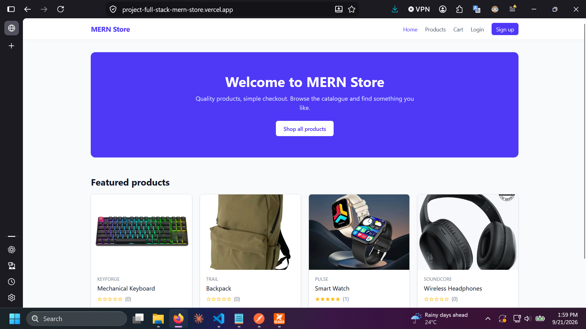
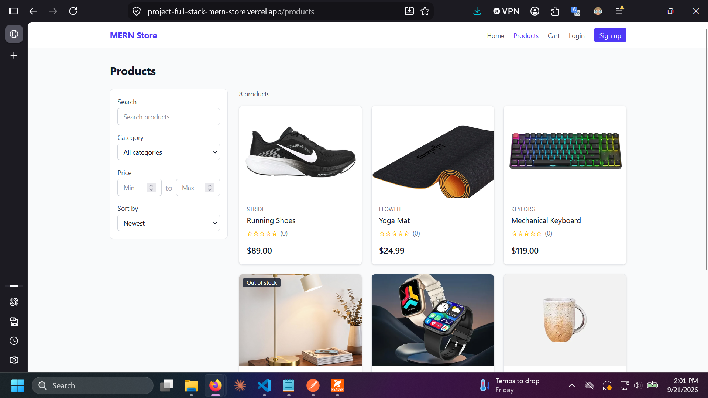
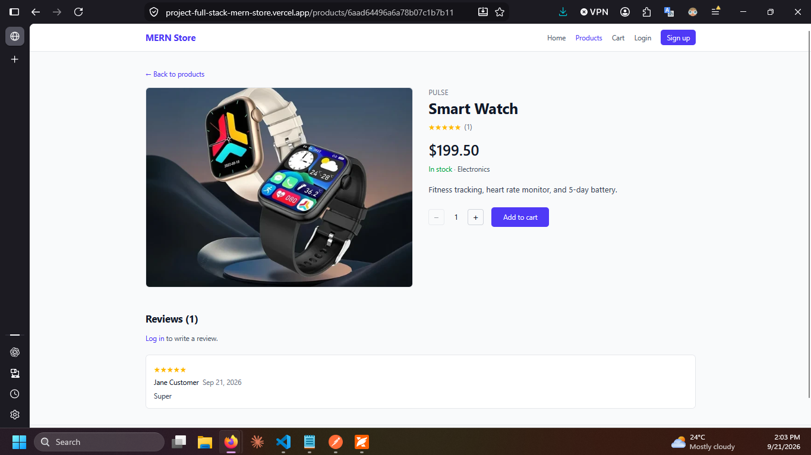
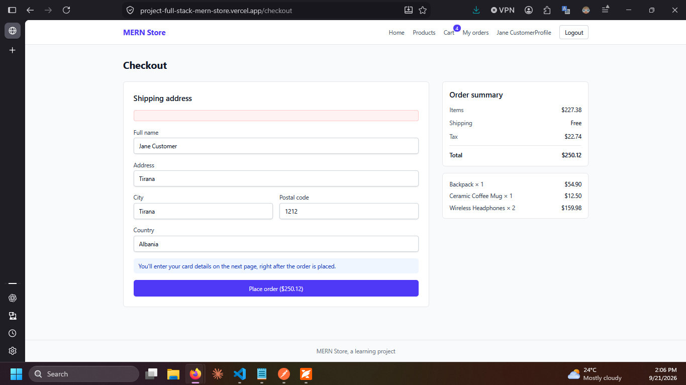
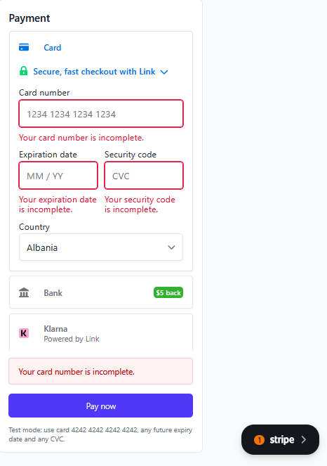
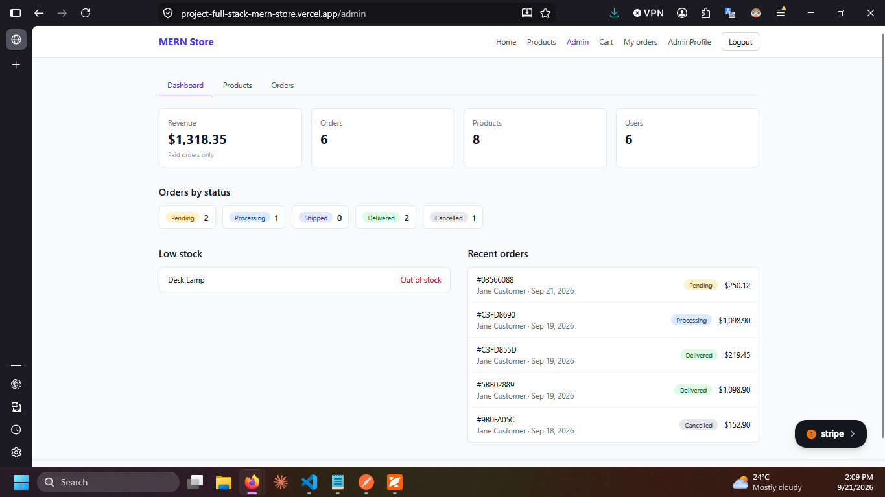
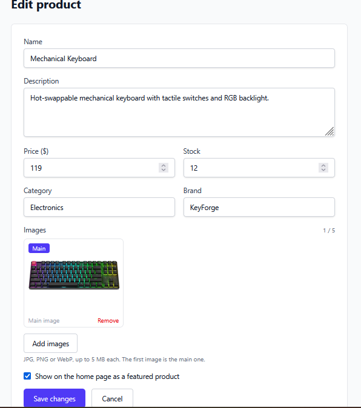
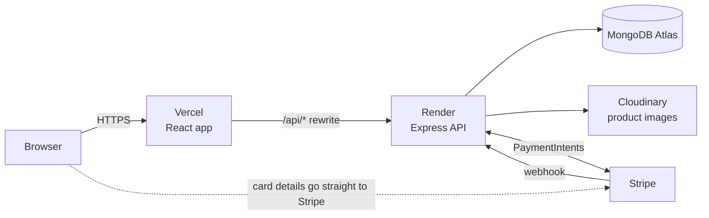
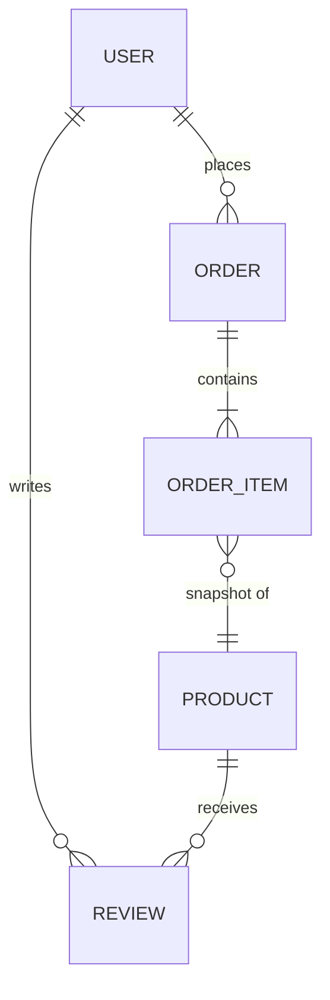

# MERN Store

A full-stack e-commerce application built with **MongoDB, Express, React and Node.js**. Customers can browse, search, review, and buy products with card payments; admins manage products, images, and orders from a dashboard.

[](https://github.com/YOUR-USERNAME/mern-store/actions/workflows/ci.yml)

**[Live demo](https://YOUR-APP.vercel.app)** · **[API health check](https://YOUR-API-NAME.onrender.com/api/health)**

> The API runs on a free Render instance that sleeps when idle, so the first request after a quiet period can take 30 to 60 seconds. Payments run in Stripe **test mode**: use card `4242 4242 4242 4242`, any future expiry date, any CVC. No real money is ever charged.

## Screenshots

<table>
  <tr>
    <td width="50%"><br><sub>Home page with featured products</sub></td>
    <td width="50%"><br><sub>Search, filters, sorting, and pagination</sub></td>
  </tr>
  <tr>
    <td><br><sub>Product page with reviews</sub></td>
    <td><br><sub>Cart and checkout</sub></td>
  </tr>
  <tr>
    <td><br><sub>Card payment with Stripe (test mode)</sub></td>
    <td><br><sub>Order history</sub></td>
  </tr>
  <tr>
    <td><br><sub>Admin dashboard</sub></td>
    <td><br><sub>Admin product form with image uploads</sub></td>
  </tr>
</table>

## Features

**Customers**
- Browse products with keyword search, category and price filters, sorting, and pagination. Filters live in the URL, so any view can be shared or bookmarked.
- Product pages with an image gallery, stock status, and ratings.
- Reviews from verified buyers only (the order must be delivered), with edit and delete.
- Shopping cart saved in the browser, and a checkout with a shipping address.
- Card payments through Stripe, with order history and cancellation of unpaid orders.
- Profile page with password change.

**Admins**
- Dashboard with revenue, order counts by status, low-stock alerts, and recent orders.
- Product management: create, edit, delete, feature on the home page, and upload up to five images each (stored on Cloudinary).
- Order management: search by status and move orders through pending, processing, shipped, and delivered. Cancelling a paid order refunds it automatically.

## Tech stack

| Layer | Technology |
|---|---|
| Frontend | React, React Router, Tailwind CSS, Axios, Vite |
| Backend | Node.js, Express, Mongoose, JSON Web Tokens, bcrypt |
| Database | MongoDB (Atlas in production) |
| Images | Multer (in-memory) and Cloudinary |
| Payments | Stripe PaymentIntents and Payment Element, with webhooks |
| Testing | Vitest, Supertest, mongodb-memory-server, Testing Library |
| Hosting | Vercel (client), Render (API), MongoDB Atlas, GitHub Actions (CI) |

## Architecture



The browser only ever talks to the Vercel domain. Vercel forwards `/api/*` to the API, so the login cookie is first-party, which matters for browsers that block third-party cookies.

**Data model**



## Engineering highlights

- **The server owns the money.** The client sends only product ids and quantities. Names, prices, shipping, tax, and totals are calculated on the server from the database, and payment amounts come from the saved order.
- **No overselling.** Stock is reserved with conditional atomic updates (`countInStock >= qty`), so two buyers can't take the last item. If any step fails, the stock already taken is put back.
- **Payments that survive real life.** PaymentIntents use idempotency keys, so reloads and double clicks never create duplicates. An order is marked paid by either the signature-verified webhook or a server-side check with Stripe, and that step is safe to run twice. A payment for an order cancelled in the meantime is refunded.
- **Auth done carefully.** JWT in an `httpOnly` cookie, role-based middleware, generic login errors, password change requiring the current password, and roles that can't be set through the API.
- **Layered upload validation.** Browser checks, then Multer limits (type, size, count), then Cloudinary's format check. Uploads are streamed from memory, never written to disk, and abandoned uploads are cleaned up.
- **Centralised error handling.** One error middleware turns Mongoose, Multer, and validation failures into consistent JSON responses.
- **Security basics.** Helmet, a CORS allow-list, no secrets in the client bundle, and card data that never touches the server.

## Project structure

```
mern-store/
├── server/
│   ├── config/         database, Cloudinary, Stripe
│   ├── controllers/    request handlers
│   ├── middleware/     auth, uploads, error handling
│   ├── models/         Mongoose schemas
│   ├── routes/         Express routers
│   ├── tests/          integration tests
│   └── utils/
├── client/
│   └── src/
│       ├── api/        one module per resource
│       ├── components/
│       ├── context/    auth and cart state
│       ├── hooks/
│       ├── pages/      including pages/admin
│       └── utils/
├── docs/screenshots/
├── DEPLOYMENT.md
└── .github/workflows/ci.yml
```

## Getting started

**Prerequisites:** Node.js 20 or newer, and a MongoDB database (local, or a free Atlas cluster). Cloudinary and Stripe test accounts are only needed for image uploads and payments.

```bash
git clone https://github.com/YOUR-USERNAME/mern-store.git
cd mern-store

# API
cd server
npm install
cp .env.example .env        # Windows: copy .env.example .env
# edit .env (see the table below)
npm run seed                # sample data (WARNING: deletes existing data)
npm run dev                 # http://localhost:5000

# Client (second terminal)
cd client
npm install
cp .env.example .env
npm run dev                 # http://localhost:5173
```

`npm run seed` creates two local development accounts:

| Role | Email | Password |
|---|---|---|
| Admin | `admin@example.com` | `admin123` |
| Customer | `jane@example.com` | `jane123` |

These exist only in your local database. Never use the seed script in production.

### Environment variables

**`server/.env`**

| Variable | Purpose |
|---|---|
| `PORT` | API port (default 5000) |
| `MONGO_URI` | MongoDB connection string |
| `JWT_SECRET` | Long random string used to sign login tokens |
| `CLIENT_URL` | Allowed website origin(s), comma-separated |
| `CLOUDINARY_CLOUD_NAME`, `CLOUDINARY_API_KEY`, `CLOUDINARY_API_SECRET` | Image uploads |
| `STRIPE_SECRET_KEY` | Stripe test secret key (`sk_test_...`) |
| `STRIPE_WEBHOOK_SECRET` | Webhook signing secret (`whsec_...`) |

**`client/.env`**

| Variable | Purpose |
|---|---|
| `VITE_STRIPE_PUBLISHABLE_KEY` | Stripe test publishable key (`pk_test_...`) |
| `VITE_API_URL` | Leave empty: in development Vite proxies `/api` to the API |

To test webhooks locally, use the [Stripe CLI](https://stripe.com/docs/stripe-cli): `stripe listen --forward-to localhost:5000/api/payments/webhook`.

## API overview

| Method | Endpoint | Access |
|---|---|---|
| POST | `/api/auth/register`, `/login`, `/logout` | public |
| GET / PUT | `/api/auth/me`, `/api/auth/profile` | user |
| GET | `/api/products` (search, filter, sort, paginate), `/api/products/categories`, `/api/products/:id` | public |
| POST / PUT / DELETE | `/api/products`, `/api/products/:id` | admin |
| GET / POST | `/api/products/:id/reviews` | public / buyer |
| PUT / DELETE | `/api/reviews/:id` | author (delete also admin) |
| POST | `/api/orders` | user |
| GET | `/api/orders/mine`, `/api/orders/:id` | owner or admin |
| PUT | `/api/orders/:id/cancel` | owner |
| GET / PUT | `/api/orders`, `/api/orders/:id/status` | admin |
| POST | `/api/payments/create-intent`, `/api/payments/sync` | owner |
| POST | `/api/payments/webhook` | Stripe (signature verified) |
| POST / DELETE | `/api/uploads` | admin |
| GET | `/api/admin/stats` | admin |

## Testing

```bash
cd server && npm test     # API integration tests against an in-memory MongoDB
cd client && npm test     # unit tests for pricing and cart logic
```

The API tests exercise the real Express app with Supertest and cover authentication and roles, product listing and admin CRUD, server-side pricing, stock reservation and rollback, order permissions and cancellation, and the verified-purchase review rules. The first run downloads a MongoDB binary. Tests run automatically on every push through GitHub Actions.

## Deployment

The app runs on Vercel, Render, and MongoDB Atlas. See [DEPLOYMENT.md](DEPLOYMENT.md) for the full walkthrough, environment variables, and troubleshooting.

## Known limitations and ideas

- No order confirmation emails yet (Nodemailer is the natural next step).
- No rate limiting on the login endpoint.
- Orders store the product image URL as it was at purchase time, so deleting a product's images leaves blank thumbnails on old orders.
- Payments are in Stripe test mode, and only cards are enabled.
- No admin screen for managing users.
